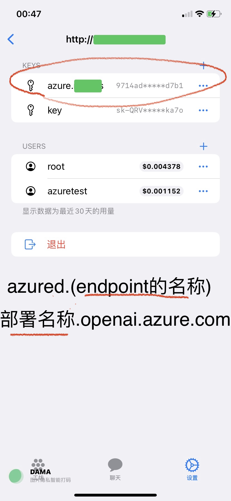
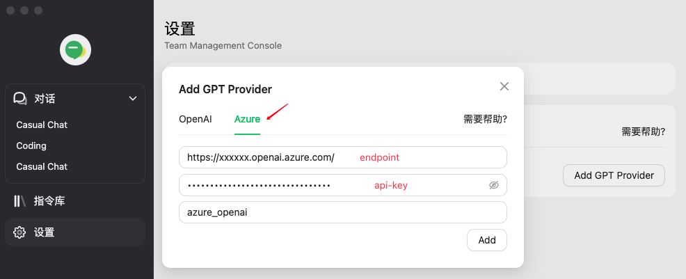

# Azure OpenAI for team

1.需要获取 api-key和endpoint [https://[resource name].openai.azure.com/)

> 2.Pleause use model name as deployment name

| model name | deployment name |
| --- | --- |
|gpt-35-turbo | gpt-35-turbo |
|gpt-35-turbo-16k | gpt-35-turbo-16k |
| gpt-4 | gpt-4 |

## How to use
- opencat 使用方式
  - key name以 azure.[resource name]的方式添加
  - 密钥任取一个
  - 
- [AMA(问天)](http://bytemyth.com/ama) 使用方式
  - 
  - 每个 team server 用户旁边有一个复制按钮，点击后，把复制的链接粘贴到浏览器，可以一键设置

## Claude

- opencat 添加Claude api, key name以 "claude.key名称",即("Api类型.Key名称")
