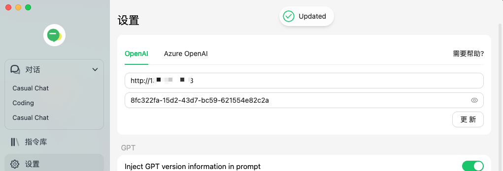

# pandora for team

[pandora](https://github.com/pengzhile/pandora)是一个把ChatGPT(web/App)接口化的项目，可以看做是第三方 OpenAI API 提供方(接口和OpenAI一致)

## 准备
- https://ai.fakeopen.com/auth1 获取accesstoken

- https://ai.fakeopen.com/token 创建apikey

## 客户端设置

1.添加接口
 

2.创建用户&Copy Config
 

 Ex:`ama://set-api-key?server=http%3A%2F%2F123.456.7.89&key=8fc322fa-15d2-43d7-bc59-621554e82c2a`

3.Configure Client

3.测试聊天
 